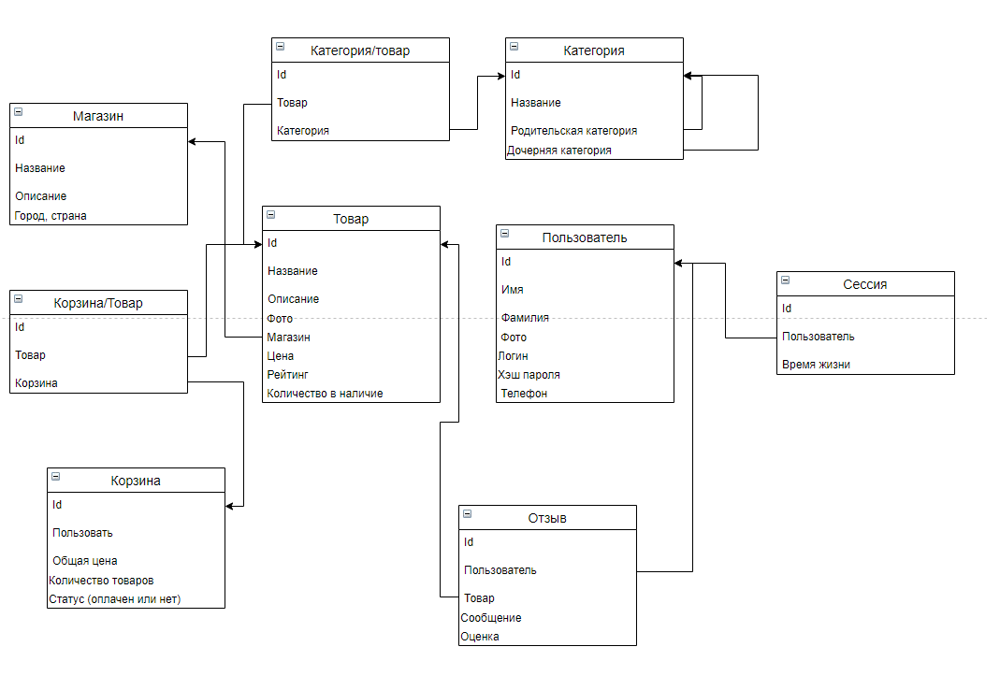

# Ozon
### 1. Целевая аудитория
* Сегменты: США, Россия, европейские страны.
* Количество активных пользоваетелей в месяц ~ 50млн
* В озрастная категория: 18-45 лет
### 2. Расчёт нагрузки
Количество активных пользователей в месяц ~ 50млн. Из них каждый пользователь пользуется сервисом в среднем 7 дней в месяц. То есть вероятность того, что юзер будет пользоваться сервисом в конкретный день ~ 25%. 
Тогда получим количество уникальных пользователей в день: 50млн * 0.25 ~ 12,5 млн пользователей.

#### Основные дейсвтвия на сервисе:
* регистрация и авторизация
* Просмотр товара
* Просмотр списка товаров по разным категориям и фильтрам
* Работа с корзиной
* Отзывы и оценки
* Заказ товара

Каждый юзер будет пользоваться сервисом примерно 1-2 раза в день (в среднем 1.5 раза)
Сценарий одного использования:
* регистрация или авторизация: 0-1 раз (0.5 в среднем) 
* Просмотр списка товаров по разным категориям и фильтрам: 5 раза
* Просмотр товара: 15 раз.
* Добавление в корзину: 2 раза.
* Отзыв и оценка: 0-1 раз (0.5)
* Заказ товара: 1 раз

Тогда получается, что среднее количество основных действий за одно исрользование: 24.
В день: 24 * 1.5 = 36.Тогда в день общее количество запросов от всех пользователей получится: 12500000 * 36 = 450млн. Отсюда мы получаем средний RPS (запросов в секунду) ~ 6 тыс.

#### RPS по разным видам запросов:
* регистрация и авторизация ~ 120
* Просмотр товара ~ 3750
* Просмотр списка товаров по разным категориям и фильтрам ~ 1250
* Работа с корзиной ~ 500
* Отзывы и оценки ~ 120
* Заказ товара ~ 240

### 3. Логическая схема БД.
Основные сущности: Товар, пользователь, магазин, категория, корзина.

