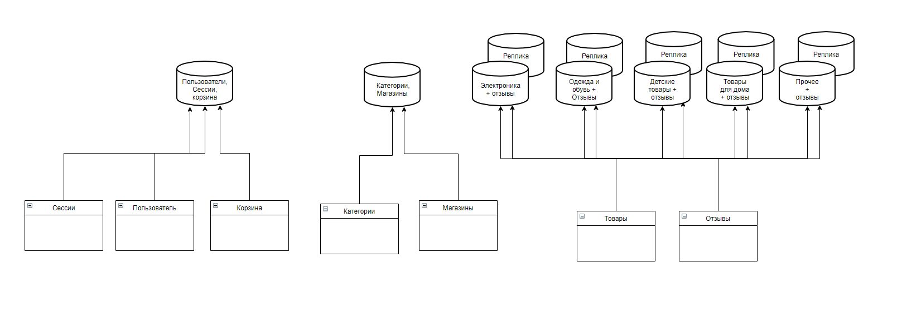
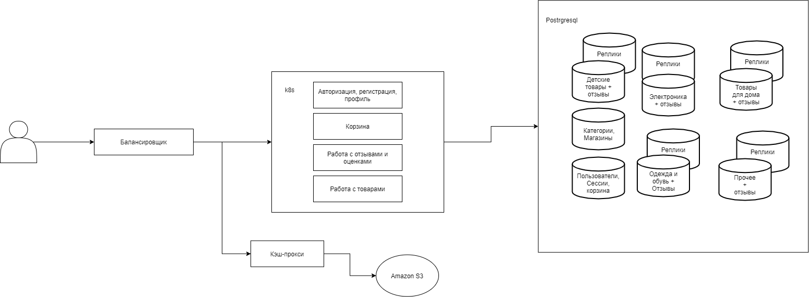

# Ozon
### 1. Целевая аудитория
* Сегменты: США, Россия, европейские страны.
* Количество активных пользоваетелей в месяц ~ 50млн
* В озрастная категория: 18-45 лет
### 2. Расчёт нагрузки
Количество активных пользователей в месяц ~ 50млн. Из них каждый пользователь пользуется сервисом в среднем 7 дней в месяц. То есть вероятность того, что юзер будет пользоваться сервисом в конкретный день ~ 25%. 
Тогда получим количество уникальных пользователей в день: 50млн * 0.25 ~ 12,5 млн пользователей.

#### Основные дейсвтвия на сервисе:
* регистрация и авторизация
* Просмотр товара
* Просмотр списка товаров по разным категориям и фильтрам
* Работа с корзиной
* Отзывы и оценки
* Заказ товара

Каждый юзер будет пользоваться сервисом примерно 1-2 раза в день (в среднем 1.5 раза)
Сценарий одного использования:
* регистрация или авторизация: 1 раз (0.5 в среднем) 
* Просмотр списка товаров по разным категориям и фильтрам: 5 раза
* Просмотр товара: 15 раз.
* Добавление в корзину: 2 раза.
* Отзыв и оценка: 0-1 раз (0.5).
* Заказ товара: 0-1 раз.

Тогда получается, что среднее количество основных действий за одно исрользование: 24.
В день: 24 * 1.5 = 36.Тогда в день общее количество запросов от всех пользователей получится: 12500000 * 36 = 450млн. Отсюда мы получаем средний RPS (запросов в секунду) ~ 6 тыс.

#### RPS по разным видам запросов:
* регистрация и авторизация ~ 240
* Просмотр товара ~ 3750
* Просмотр списка товаров по разным категориям и фильтрам ~ 1250
* Работа с корзиной ~ 500
* Отзывы и оценки ~ 120
* Заказ товара ~ 120

#### Оценим общий объем картинок
OZON торгует более 9 млн товарных наименований. Каждый товар содержит в среднем 4 фотографии. Каждая картинка весит в среднем 50 kB. Отсюда получаем: 50 * 4 * 10000000 = 2млрд kB.

#### Оценим размер загружаемых картинок одним пользователем за одно использование
* Просмотр списка товаров по разным категориям и фильтрам: 5 * 500Кб ~ 2.5Мб.
* Просмотр товара: 15 * 250Кб ~ 4Мб.
* Прочее: 1Мб.

Тогда в день один пользователей загружает примерно 10 Мб картинок. Тогда в день общее количество загружаемых картинок составляет 10*12500000 = 125 млн Мб

### 3. Логическая схема БД.
Основные сущности: Товар, пользователь, магазин, категория, корзина.

### 4. Физическая схема БД.
Все данные будем хранить с помощью СУБД PostgreSQL. Главными причинами такого выбора является:
* Поддержка БД неограниченного размера
* Мощные и надёжные механизмы транзакций и репликации
* Легкая расширяемость

OZON торгует более 9 млн товарных наименований. Именно поэтому товары необходимо шардировать по разным инстансам. Товары необходимо разделить по равным по размеру категориям. Я выделил 5 основных категорий:
1) Электроника
2) Одежда и обувь
3) Детские товары
4) Товары для дома
5) Прочее

Просмотр списка товаров по разным категориям и фильтрам это очень сложный запрос, который сильно нагружает базу данных. Учитывая, что таких запросов достаточно много (1250 RPS), то необходимо еще масштабировать БД. Воспользуемся master-slave репликацией.

Я создал тестовую БД с товарами и заполнил ее 2млн записей (именно столько товаров в среднем в каждой категории). Тестировал я ее с помощью запроса вида:

"select * from tovar where name LIKE '%ame1%' and price<50 and category='electric' LIMIT 100"

Таким образом 1250 запросов бд выполнила за 2.7 секунды.

То есть БД способна выдержать 500 RPS такого вида. Поэтому для каждой категории товаров необходимо создать еще 3 реплики, которые будут использоваться только для поиска товаров по разным категориям и фильтрам. А мастер будет использоваться для остальных запросов.

Таким образом, разделение по разным инстансам выглядит следующим образом:
   

Для храниения картинок воспользуемся сетевым хранилищем Amazon S3. Это хранилище предназначено для хранения огромного количества данных и является очень надежным.

### 5. Выбор технологий.

#### Бэкенд:
Для бэкенда будем использовать язык программирования Golang. Этот язык имеет высокую производительность благодаря эффекктивному параллелизму. Язык достаточно простой и в нем достаточно тяжело где-то допустить ошибку.
В общем, можно выделить следующие преимущества языка:
* Строгая типизация.
* Простота синтаксиса, низкий уровень вхождения.
* Многопоточность из «коробки», на уровне самого языка.
* Кроссплатформенность.
* Высокая производительность.

Для обеспечения надежности определенно нужны микросервисы. Я выделил 4 микросервиса:
* Авторизация
* Корзина
* Работа с профилем
* Работа с товарами

Микросервисы будут общаться по протоколу gRpc, а данные будут передаваться в формате protobuf.

#### Фронтенд:
Для фронтенда будут использованы все стандартные технологии: javascript, HTML, CSS. Приложение будет использовать технологию SPA, то есть почти весь код будет написан на JS.
Для уменьшения используемого трафика, код на JS будет собираться в бандл с помощью Webpack.

Фронтенд будет общаться с бэкендом по протоколу http в формате json.

#### Nginx:
Будем использовать nginx для следующих целей:
* Отдача статики
* Прокси
* Балансировщик нагрузки

Nginx на данный момент является одним из лучших веб-серверов, это связано с очень высокой производительность.
  

Для балансировки нагрузки будем использовать подход round-robin:
  Веб сервер равномерно распределяет нагрузку на сервера с учетом их весов.

### 6. Схема проекта.
Сервисы будут деплоиться в kubernetes. Базы данных будут работать на "голом" железе, их конфиги будут доставляться по средствам puppet.

   

### 7. Расчет потребного оборудования.
#### Бэкенд
Было выделено 4 микросервиса:
* Авторизация
* Корзина
* Работа с профилем
* Работа с товарами
За секунду 16 ядерный сервер в целом может держать 4 000 RPS. Поэтому достаточно держать по одному серверу для каждого микросервиса. Для отказоустойчивости возьмем в 2 раза больше.

#### Балансировщик + фронтенд
Нам достаточно 4 сервера, но для надежности возьмем 8.

#### БД

